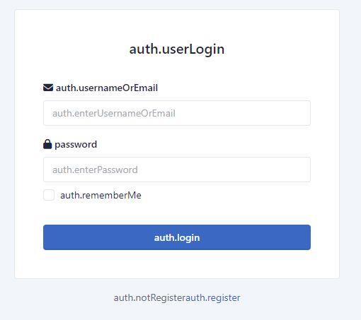

# 语言无法正常显示

若出现语言加载异常的情况（如下图），这是Thinkphp的BUG，请按照本教程修复\


<figure><figcaption></figcaption></figure>

&#x20;打开 `根目录/vendor/topthink/framework/src/think/Lang.php` 找到以下内容

```php
protected $config = [
    // 默认语言
    'default_lang'    => 'zh-cn',
    // 允许的语言列表
    'allow_lang_list' => [],
    // 是否使用Cookie记录
    'use_cookie'      => true,
    // 扩展语言包
    'extend_list'     => [],
    // 多语言cookie变量
    'cookie_var'      => 'think_lang',
    // 多语言header变量
    'header_var'      => 'think-lang',
    // 多语言自动侦测变量名
    'detect_var'      => 'lang',
    // Accept-Language转义为对应语言包名称
    'accept_language' => [],
    // 是否支持语言分组
    'allow_group'     => false,
];
```

这里需要修改前三个参数。如果需要强制指定语言为 en-us，则修改成：

```php
protected $config = [
    // 默认语言
    'default_lang'    => 'en-us', // 这里改成需要指定的语言
    // 允许的语言列表
    'allow_lang_list' => ['en-us'], // 数组中只包含该语言
    // 是否使用Cookie记录
    'use_cookie'      => false, // 关闭语言自动识别
    // 扩展语言包
    'extend_list'     => [],
    // 多语言cookie变量
    'cookie_var'      => 'think_lang',
    // 多语言header变量
    'header_var'      => 'think-lang',
    // 多语言自动侦测变量名
    'detect_var'      => 'lang',
    // Accept-Language转义为对应语言包名称
    'accept_language' => [],
    // 是否支持语言分组
    'allow_group'     => false,
];
```

保存文件，清除Cookies，刷新网页，完成。
